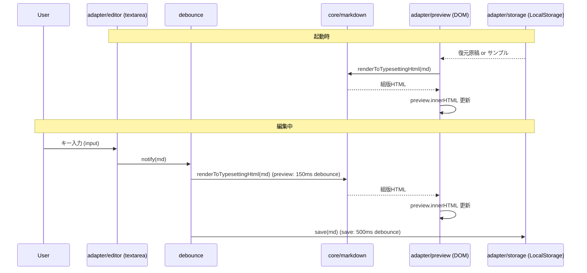
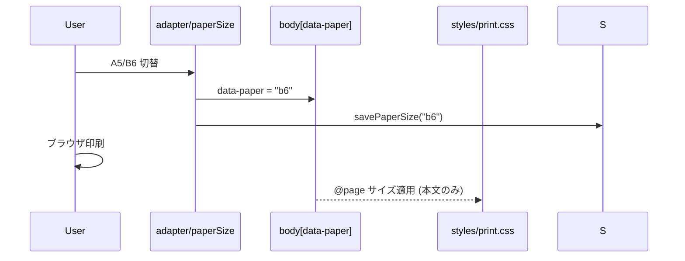

# tatemd MVP-1（縦書きプレビュー）Design

## Overview

Vanilla TS + Vite による完全クライアントサイドの静的 Web アプリ。
中核は「Markdown 文字列 → 組版用 HTML 文字列」への純粋変換（`core/`）と、
それを DOM・LocalStorage・印刷へ橋渡しする UI 層（`adapter/`）の分離。
縦書き・禁則・英数字整列・両端揃え等の**組版表現はすべて CSS にネイティブ委譲**し、
JS では一切の組版補正を行わない。

設計上のキーポイント:
- `core/` は markdown-it を内包してよいが、**DOM・window・localStorage に触れない**。入出力は文字列のみ。
- markdown-it は `html: false` で初期化し、生 HTML をエスケープ（FR-007 / XSS 対策）。追加サニタイザ（DOMPurify）は MVP-1 では導入しない。
- リアルタイム反映・保存はデバウンスで負荷を抑える。

## Architecture

### Directory Layout

```
tatemd/
├── index.html
├── src/
│   ├── main.ts                 # エントリ。adapter を起動
│   ├── core/
│   │   ├── markdown.ts         # renderToTypesettingHtml(md): string  ← 純粋関数
│   │   ├── sampleManuscript.ts # SAMPLE_MANUSCRIPT: string（オリジナル書き下ろし）
│   │   └── ruby.ts             # 【設計余地のみ】ルビ記法パーサのIF定義（MVP-1は未使用）
│   ├── adapter/
│   │   ├── app.ts              # 全体の組み立て（DOM参照・イベント結線）
│   │   ├── editor.ts           # textarea の input 監視
│   │   ├── preview.ts          # core を呼び preview DOM を更新
│   │   ├── storage.ts          # LocalStorage 読み書き（原稿・用紙サイズ）
│   │   ├── paperSize.ts        # A5/B6 切替の状態管理 + body data 属性反映
│   │   └── debounce.ts         # 汎用デバウンス
│   └── styles/
│       ├── app.css             # 2ペインレイアウト・UI
│       ├── vertical.css        # 縦書き組版（writing-mode 等）
│       └── print.css           # @media print / @page（A5/B6）
├── specs/                       # SDD 仕様
├── .github/workflows/deploy.yml
├── vite.config.ts
└── （README/ROADMAP/LICENSE/CONTRIBUTING は別途）
```

### Components

- **core/markdown.ts**: `renderToTypesettingHtml(markdown: string): string`。markdown-it で AST→HTML 変換し、組版用にクラス付与した HTML 文字列を返す。DOM 非依存・副作用なし・テスト可能。
- **core/sampleManuscript.ts**: 同梱サンプル原稿（文字列定数）。
- **adapter/app.ts**: 起動時に storage から復元（無ければサンプル）、editor↔preview↔storage を結線。
- **adapter/editor.ts**: `<textarea>` の `input` を購読し、デバウンス済みコールバックへ通知。
- **adapter/preview.ts**: 受け取った Markdown を core に渡し、戻り HTML を `.tategaki`（`.preview-pane` 内）の `innerHTML` に反映。印刷の抽出対象である `.tategaki` の DOM 位置を確定して保持する。
- **adapter/storage.ts**: 原稿本文・用紙サイズを LocalStorage に get/set。永続化は薄い IF（`load/save`）に閉じ、将来 VSCode 等への差し替え余地を残す。例外を握りつぶしてアプリ継続（FR-005 / IF localStorage 不可）。
- **adapter/paperSize.ts**: `'a5' | 'b6'` の状態を保持し、`<body data-paper>` 属性へ反映＋`<style id="print-page">` の `@page { size }` を差し替える（印刷セクション参照）。storage と連動。
- **styles/**: 縦書き・印刷の CSS。**組版ロジックはここが唯一の置き場**。

### Data Flow





## Data Models

```typescript
// core: 入出力は文字列のみ（DOM非依存）
export function renderToTypesettingHtml(markdown: string): string;

// adapter: 永続化スキーマ
type PaperSize = 'a5' | 'b6';

interface PersistedState {
  manuscript: string;   // エディタ本文
  paperSize: PaperSize; // 用紙サイズ選択
}

// LocalStorage キー（バージョン付きで将来のスキーマ変更に備える）
const STORAGE_KEYS = {
  manuscript: 'tatemd.manuscript.v1',
  paperSize: 'tatemd.paperSize.v1',
} as const;

// 【設計余地のみ・MVP-1未実装】ルビ記法パーサのIF
// ｜漢字《かんじ》 → { base: '漢字', ruby: 'かんじ' }
interface RubyToken { base: string; ruby: string; }
// export function parseRuby(text: string): Array<string | RubyToken>;  // 将来実装
```

## Markdown 変換方針（core/markdown.ts）

- markdown-it を `{ html: false, linkify: false, breaks: true }` で初期化。
  - `html: false`: 生 HTML をエスケープ（FR-007）。
  - `breaks: true`: 原稿中の単一改行を `<br>` に（縦書き小説で改行を意図通り反映）。
  - `linkify: false`: URL の自動リンク化を無効（縦書きで URL が崩れるのを避ける）。
- **Tier 1（必達）**: 既定の markdown-it で見出し/段落/強調/リスト/hr/blockquote を出力。
- **Tier 2（実装するが縦書き破綻なら除外）**: link/image。レンダリング後に縦書き表示を実機確認し、破綻するものは ROADMAP へ。
  - **URL スキーム無害化（P2指摘反映）**: link/image を有効化したら、`href`/`src` の `javascript:`・`data:`（画像以外）等の危険スキームを除去する markdown-it の `validateLink` を設定する。`html:false` だけでは属性経由の XSS（`javascript:` リンク）を防げないため。
- **Tier 3（Tier 2 成功時のみ）**: code block/table。
- 出力ラッパ: 本文全体を **`<div class="tategaki">…</div>` でラップ（クラス名確定）**。CSS の適用起点・印刷の抽出対象を兼ねる。
- **段落と改行の扱い（P1指摘反映）**: `breaks:true` により本文中の単一改行は `<br>`、空行区切りは `<p>` 段落となり、二重の改行表現が共存する。縦書きで「段落アキ」と「`<br>` 行送り」が視覚的に揃うよう、段落の字下げは CSS（`.tategaki p { text-indent: 1em }` 等）で最小補正する（組版表現＝CSS 責務の範囲内）。core 側では補正しない。
- **core では禁則・約物詰め・縦中横・ルビを一切処理しない**（CSS 責務 / スコープ外）。

## CSS 組版方針（styles/vertical.css・print.css）

### 画面プレビュー（vertical.css）
```css
.tategaki {
  writing-mode: vertical-rl;
  text-orientation: mixed;     /* 英数字を自然な向きで整列 */
  line-break: strict;          /* 禁則はブラウザ委譲 */
  text-align: justify;         /* 均等割り付けはベストエフォート（下記注記） */
  /* 行間・字間・フォントは初期プレースホルダ値（数値のみ後で調整） */
}
.tategaki p { text-indent: 1em; }  /* 段落字下げ（breaks:true との両立・最小補正） */
```
- **段落アキの方式は Wave 0.2 で確定**: 段落間アキを `text-indent` のみで賄うか `margin-inline-start`（行方向のアキ）を併用するかは実機で判断し、本節に反映してから vertical.css を実装する（proto では `margin-inline-start` を仮採用しているが design 未確定）。
- **`justify` はベストエフォート（P1指摘反映）**: 縦書きでの均等割り付けは行末・段落末の短い行や `text-align-last` のブラウザ差が大きく、完全な両端揃えは保証しない。受け入れ基準（合否ゲート）にはしない（requirements US-003 と整合）。
- **クロスブラウザ厳守**: Chrome 専用プロパティ（例 `word-break: auto-phrase`）に依存しない。Chrome / Safari / Firefox の縦書き改行解釈の差を実機確認（NFR Compatibility）。

### 印刷（print.css）— 方式確定（P0指摘反映）

**前提となる DOM 構造（確定）**:
```html
<body data-paper="a5">
  <header class="app-header"> … 用紙切替/印刷ボタン … </header>
  <main class="app-main">                <!-- 画面では Grid 2ペイン -->
    <textarea class="editor"></textarea>
    <section class="preview-pane">
      <div class="tategaki"> … core 出力 … </div>   <!-- 印刷の唯一の対象 -->
    </section>
  </main>
</body>
```

**(1) 本文抽出（`body > *:not()` を使わない）**: 2ペインは Grid のネスト構造なので、`body 直下の除外`では抽出できない。印刷時は「不要要素を消す」+「Grid を解除して本文を全幅に戻す」を明示する:
```css
@media print {
  .app-header, .editor { display: none !important; }
  .app-main    { display: block; }                 /* Grid 解除 */
  .preview-pane{ position: static; margin: 0; padding: 0; overflow: visible; }
  .tategaki    { /* writing-mode は vertical.css のまま保持 */ }
}
```

**(2) 用紙サイズ A5/B6 の切替（`@page` を JS で差し替え・確定方式）**: `@page` はセレクタ内ネスト不可、CSS 変数で `size` を変えられない。よって **`adapter/paperSize.ts` が `<style id="print-page">` の中身を差し替える**方式に確定する:
```ts
// paperSize.ts（抜粋）
const DIM = { a5: 'A5', b6: 'B6' } as const;
function applyPaperSize(size: PaperSize) {
  document.body.dataset.paper = size;
  let el = document.getElementById('print-page') as HTMLStyleElement | null;
  if (!el) { el = document.createElement('style'); el.id = 'print-page'; document.head.appendChild(el); }
  el.textContent = `@page { size: ${DIM[size]}; margin: 15mm; }`;  // margin は調整値
}
```

**(3) Safari フォールバック（`@page size` 不発対策・P0検証連動）**: Safari は `@page { size }` を無視し印刷ダイアログの用紙設定を優先する歴史がある。`size` に依存しきらず、**本文ボックスを用紙実寸に固定**する保険を併用する:
```css
@media print {
  body[data-paper="a5"] .tategaki { block-size: 210mm; inline-size: 148mm; }
  body[data-paper="b6"] .tategaki { block-size: 182mm; inline-size: 128mm; }
}
```
（縦書きなので行方向＝`block-size`＝紙の長辺。実寸は Wave 0 プロトタイプで最終確認。）
- **縦書きの複数ページ送り**（本文が2ページ目以降へ継続するか）はブラウザ差が大きい最大の地雷 → Wave 0 で先行検証する。

## UI レイアウト（app.css）

```
┌───────────────────────────────────────────────┐
│ ヘッダ: [tatemd]   用紙: (A5)(B6)  [印刷]        │ ← 印刷時 display:none
├──────────────────────┬────────────────────────┤
│  エディタ (textarea)   │  プレビュー (縦書き)      │
│  左 / 横書き入力        │  右 / vertical-rl        │
│                      │  ← 文字は右から左へ流れる   │
└──────────────────────┴────────────────────────┘
```
- 2ペインは CSS Grid / Flex（横並び）。レスポンシブの厳密対応は MVP-1 範囲外（最低限の縦積みフォールバックのみ任意）。

## Error Handling

- **LocalStorage 読み書き失敗（無効化・容量超過・SecurityError）**: try/catch で握りつぶし、メモリ上の状態で編集・プレビュー継続（FR-005）。保存不可時もクラッシュさせない。
- **空入力**: プレビューは空表示（エラーにしない）。
- **不正/巨大入力**: markdown-it に委譲。極端な巨大入力でのカクつきはデバウンスで緩和（NFR Performance）。
- **生 HTML/スクリプト混入**: `html: false` によりエスケープ表示（無害化）。

## Security Considerations

- 完全クライアントサイド。外部送信なし。
- XSS 対策の主防御線は markdown-it `html: false`。`innerHTML` 代入は core が返すサニタイズ済み文字列に限定し、ユーザー入力を直接 `innerHTML` しない。
- **Tier 2（link/image）有効化時の追加防御**: `html:false` は属性経由の `javascript:` リンクを防げない。markdown-it の `validateLink` で危険スキームを除去する（Markdown変換方針参照）。ユニットテストで `javascript:`/`data:` の無害化を検証する。
- 依存追加（DOMPurify 等）は MVP-1 では不要と判断。将来 `html: true` を許可する場合に再検討。

## Testing Strategy

- **Unit（core、最重要）**: `renderToTypesettingHtml` の純粋関数テスト。Vitest。
  - Tier 1 各記法が期待 HTML を生成（見出しレベル、強調、リスト、hr、blockquote、改行→`<br>`）。
  - `html: false` により `<script>` がエスケープされる。
  - 空文字・長文の安定性。
- **Unit（adapter）**: storage の get/set とフォールバック（localStorage 例外時に throw しない）。debounce の発火タイミング。
- **手動/実機（組版・印刷）**: Chrome/Safari/Firefox で縦書き表示・禁則・均等割り付け（ベストエフォート）の確認。印刷プレビューで A5/B6 の本文のみ出力・余白確認。Tier 2/3 の縦書き破綻判定もここで実施。
- E2E 自動化は MVP-1 範囲外（手動チェックリストで代替）。

## 技術検証（Wave 0・実装本格化の前に先行）

「CSS 全振り」の中核リスクは印刷系に集中する。手戻りを避けるため、最小プロトタイプで以下を **Task 1.1 と並行して先行検証**する（tasks.md Wave 0）。

1. **【最優先】`@page { size: A5/B6 }` の 3 ブラウザ実機検証**: JS で `<style id="print-page">` を差し替えて PDF 用紙サイズに反映されるか。Safari で `size` が無視される場合に (3) の実寸固定フォールバックで本らしさが保てるか。
2. **`@media print` × 2ペインGrid の本文抽出＋縦書き複数ページ送り**: `.tategaki` のみを全幅・縦書きで出力でき、本文が 2 ページ目以降へ正しく流れるか（最大の地雷）。
3. **`line-break: strict` + `text-orientation: mixed` の改行解釈差**: 行頭/行末禁則の実挙動、半角英数字（縦中横なし）の 2 桁数字の見え方。
4. **`breaks:true` + 空行段落の縦書き表示**: 段落アキ・字下げが本らしいか。`.tategaki p { text-indent }` の要否確定。
5. **`text-align: justify` + `text-align-last` の均等割り付け実効**: 期待どおり出るか、短行で破綻しないか。出ないなら受け入れ基準を緩める（既に US-003 で緩和済み）。

検証結果は design の該当節（印刷方式・実寸値）へ反映してから Wave 2 以降に進む。

## Deployment

- Vite ビルド → GitHub Pages。
- `vite.config.ts` で `base` を `process.env.GITHUB_ACTIONS` の有無で切替（Pages のサブパス対応）。
- `.github/workflows/deploy.yml` で build → Pages デプロイ。

## Packaging & Distribution Targets（将来の配布先・MVP-1は設計余地のみ）

OSS として配布チャネルは豊富に用意する方針。MVP-1 で**出荷するのは ① のみ**だが、
②〜⑥ を将来追加できるよう **いま壊さないための制約**（3 層分離・Portability）を設計に織り込む。

| # | チャネル | 配布物 | MVP-1 | 前提（壊さないための制約） |
|---|---------|--------|-------|------------------|
| ① | GitHub Pages（ホスト型デモ） | ビルド済み Web アプリ | ✅ 出荷 | `base` の環境切替 |
| ② | GitHub リポジトリ | ソース一式（MIT） | ✅ 出荷 | README/ROADMAP/LICENSE/CONTRIBUTING |
| ③ | スタンドアロン配布 | `dist` zip（`index.html` を開くだけ／オフライン） | ⏳余地 | 相対パス・外部CDN非依存ビルド |
| ④ | npm パッケージ | `core` 変換ロジック | ⏳余地 | core の DOM/Vite 非依存 + 型定義出力 |
| ⑤ | CDN（unpkg/jsdelivr 等） | ④ を npm 経由で自動配信 | ⏳余地 | ④ が前提 |
| ⑥ | VSCode 拡張 | Webview 縦書きプレビュー | ⏳余地 | core/CSS 再利用 + 永続化の抽象化 |

> 公開先 GitHub Organization は **`torifonium`（確定・https://github.com/torifonium ）**。npm スコープも `@torifonium` を候補とする。
> 🚫 **`geniee` / `jai` の Organization には絶対に公開・push しない**（業務系のため）。
> Pages の `base` は `https://github.com/torifonium/tatemd` 前提（`/tatemd/`）で設定する。

以下、各チャネルの設計含意（①②は前述「Deployment」「OSS 成果物」を参照）。

### ③ スタンドアロン配布（`dist` zip をローカルで開く）
- `vite build` 成果物を zip 配布し、`index.html` を直接開くだけでオフライン動作させる（NFR Offline）。
- そのため**外部 CDN・絶対パス参照を持たないビルド**にする（フォント等もローカル同梱 or システムフォント前提）。`base` を相対（`./`）にできる構成を保つ。

### ④ npm パッケージ（`core` 単体配布）
- 公開対象は `src/core/`（`renderToTypesettingHtml` と将来のルビパーサ）。Web アプリ専用コード（`adapter/`）は含めない。
- そのため `core/` は **DOM/window/localStorage/Vite 固有 API に非依存**（NFR Portability）。markdown-it は core が内包してよい（Node/ブラウザ両対応）。
- 想定パッケージ名は未確定（例: `@<scope>/tatemd-core`）。MVP-1 では publish しない。
- 実現には将来 `package.json` の `exports` 整理・型定義（`.d.ts`）出力・core 専用ビルドが必要 → ROADMAP。

### ⑤ CDN（unpkg / jsdelivr）
- ④ を npm publish すれば unpkg/jsdelivr から自動配信される（追加作業は最小）。④ が前提。`<script type="module">` で `core` を読む使い方を README に例示できる → ROADMAP。

### ⑥ VSCode 拡張（Webview 縦書きプレビュー）
- 拡張は Markdown ドキュメントを取得 → `core.renderToTypesettingHtml` で変換 → **Webview** に `vertical.css`/`print.css` 付きで描画、という構成を想定。
- core はそのまま再利用（拡張ホスト or Webview 側で実行）。組版 CSS も素の CSS としてそのまま流用できるよう、特定バンドラ前提の記法を避ける。
- LocalStorage 依存箇所（`adapter/storage.ts`）は VSCode では別実装（`workspace`/`globalState`）になるため、永続化は **インターフェースで抽象化**しておくと移植が楽（MVP-1 では Web 実装のみ、IF を意識した薄い関数境界に留める）。
- 拡張本体（`package.json` の `contributes`、Webview ブリッジ）は MVP-1 では実装しない → ROADMAP。

### 共通の設計含意
- 「変換ロジック（core）」「組版表現（CSS）」「ホスト統合（adapter）」の 3 層分離を維持することが、上記 2 配布先の前提条件。MVP-1 の adapter 実装でもこの境界を曖昧にしない。

## 要件トレーサビリティ

| 要件 | 対応設計 |
|------|---------|
| US-001 / FR-001 | app.ts 起動時復元ロジック + core/sampleManuscript.ts |
| US-002 / FR-003 | editor.ts(input) → debounce.ts → preview.ts（一方向） |
| US-003 / FR-004 | styles/vertical.css（writing-mode / line-break / text-orientation / justify） |
| US-004 / FR-002 / FR-007 | core/markdown.ts（ティア制・`html:false`） |
| US-005 / FR-005 | adapter/storage.ts（例外握りつぶし） |
| US-006 / FR-006 | adapter/paperSize.ts（`<style id="print-page">` 差し替え）+ styles/print.css（本文抽出・実寸フォールバック） |
| NFR Architecture | core/ DOM非依存・adapter/ がcoreを呼ぶ構成 |
| NFR Deploy | vite.config.ts base 切替 + workflows/deploy.yml |
